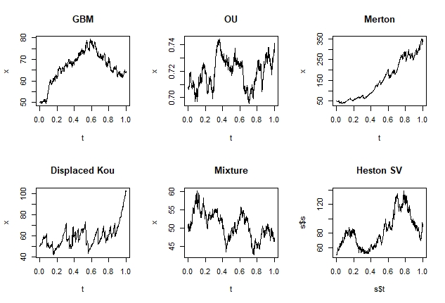
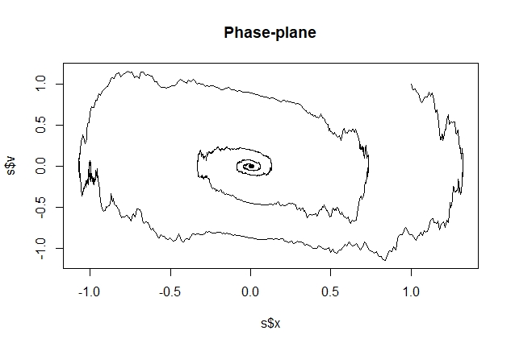

# sdes

<!-- badges: start -->
<!-- badges: end -->

Solve SDEs in R using either an Euler-Maruyama, Milstein, or RK2 scheme. The former is implemented for one-dimensional SDEs for Ito processes, exponential Ito-Levy processes, two-state correlated systems, and systems of finite dimension with either independent driving Brownian motions or just one. The latter two schemes are only available for one-dimensional SDEs, the Milstein only for autonomous SDEs (i.e. the coefficient functions are functions of space alone), while the EM and RK2 scheme is implemented for time-inhomogeneous SDEs.


## Installation

You can install the current GitHub version via devtools

``` r
devtools::install_github("shill1729/sdes")
```

### Examples
## SDEs for stock-prices
Here is an example simulating a GBM, OU process, Merton jump diffusion,
displaced Kou jump diffusion, mixture diffusion, and Heston stochastic volatility model for price dynamics:
```r
library(sdes)
x0 <- 50
v0 <- 0.5
tt <- 1
n <- 1000
# GBM
mu <- 0.05
volat <- 0.2
# Jump models:
lambda <- 30
# Merton
mj <- -0.09
sdj <- 0.01
# Displaced Kou
p <- 0.1
alpha <- 0.09
beta <- 0.09
ku <- 0.08
kd <- -0.02
# Mean-reverting volatility
kappa <- 1
theta <- 0.5
xi <- 0.1
rho <- -0.2
# Mixture of log-normals
mixture <- rbind(c(0.8, 0.2),
                 c(0.1, -0.1),
                 c(0.2, 0.8)
)
# Wrapping it all up
gbm <- c(mu, volat)
ou <- c(kappa, theta, xi)
merton <- c(mu, volat, lambda, mj, sdj)
diskou <- c(mu, volat, lambda, p, alpha, beta, ku, kd)
heston <- c(mu, rho, kappa, theta, xi)
# Plotting all of the sample paths
par(mfrow = c(2, 3))
sde_gbm(x0, tt, gbm, n)
sde_ou(v0, tt, ou, n)
sde_merton(x0, tt, merton, n)
sde_dkou(x0, tt, diskou, n)
sde_mixture(x0, tt, mixture, n)
sde_heston(x0, v0, tt, heston, n)
```


## Noisy harmonic oscillator
```r
#=========================================================
# Noisy harmonic oscillator
#=========================================================
library(sdes)
n <- 4000
tn <- 50
q <- 0.2
omega <- 1
volat <- 0.5
IC <- list(x = 1, v = 1)
# System description:
# simple harmonic restoring force:
# -omega^2 x
# damping force
# -2q omega v
# random white noise proportional to x
drifts <- list(function(t, x, v) v,
               function(t, x, v) -2*q*omega*v-(omega^2)*x
)
diffusions <- list(function(t, x, v) 0,
                   function(t, x, v) volat*x
)
# Numerically solve with Euler-Maruyama
s <- sdes::sde_system(IC, 0, tn, drifts, diffusions, FALSE, n)
# We can see the phase-plane tends to the origin
# for most values of sigma=volat
par(mfrow = c(1, 1))
plot(s$x, s$v, type = "l", main = "Phase-plane")
```


